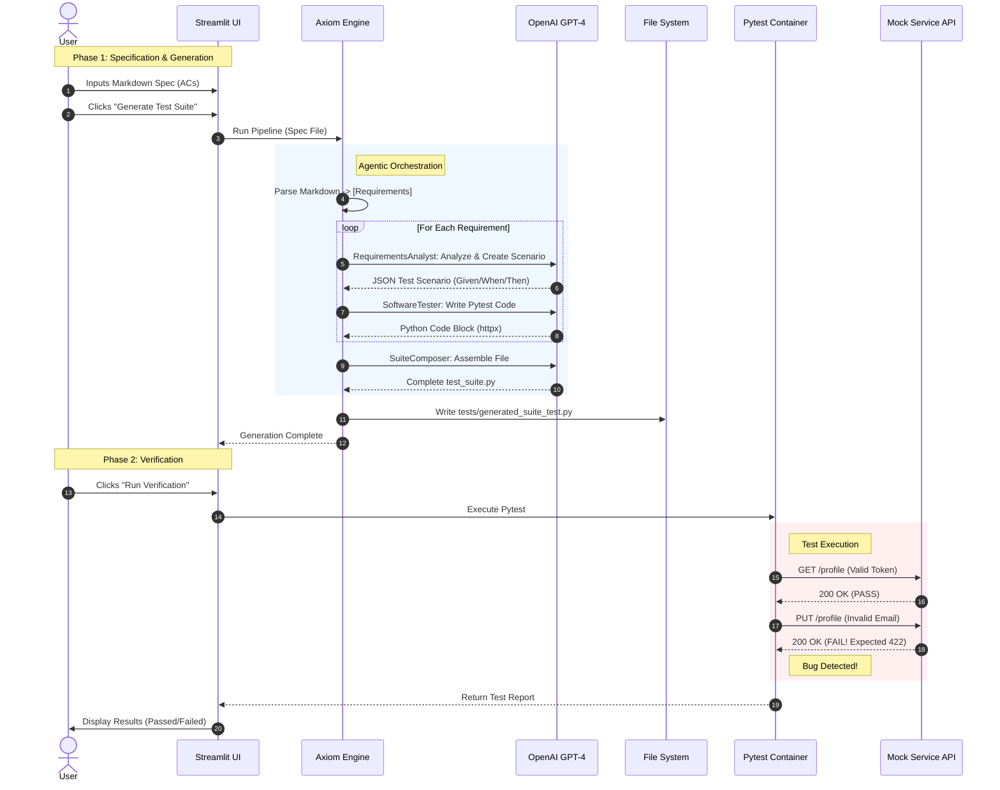

# Axiom: Agentic Spec-to-Test Pipeline

Axiom is an intelligent pipeline that transforms natural language **specifications (Markdown)** into executable **Pytest suites** using LangChain agents.

## Architecture



## Codeflow
1.  **Specification**: Users write requirements in `docs/project_sample.md` (User Stories, ACs).
2.  **Parsing**: The **Engine** parses these into structured data.
3.  **Analysis (Agent 1)**: The `RequirementsAnalyst` breaks down ACs into logical **Test Scenarios** (Given/When/Then).
4.  **Test Generation (Agent 2)**: The `SoftwareTester` converts Scenarios into executable **Pytest** code.
5.  **Verification**: The generated suite runs against the **Target Service** (Mock Service).

## Directory Structure
- `docs/`: Specifications.
- `src/engine/`: The core logic (Agents, Parser, Orchestrator).
- `src/mock_service/`: A sample FastAPI app with an intentional bug.
- `tests/`: Output directory for generated tests.
- `main.py`: Streamlit UI for interactive usage.

## Setup & Running via Makefile

### Prerequisites
- Python 3.10+
- Docker (optional)
- OpenAI API Key

### Quick Start
1.  **Install Dependencies**:
    ```bash
    make install
    ```
2.  **Run All (Mock Service + Engine + Tests)**:
    ```bash
    make verify
    ```

### Docker Compose (Recommended)
This approach runs the Service, UI, and Tests in isolated containers on a shared network.

1.  **Start App**:
    ```bash
    docker-compose up -d axiom-ui
    ```
    Access UI at `http://localhost:8501`.

2.  **Run Tests in Container**:
    ```bash
    docker-compose run --rm axiom-tests
    ```

### Manual Running
- **UI**: `streamlit run main.py`
- **Engine**: `python src/engine/main.py docs/project_sample.md tests/generated_suite_test.py http://localhost:8000`

## Showcase


Created with ❤️ with Gemini!